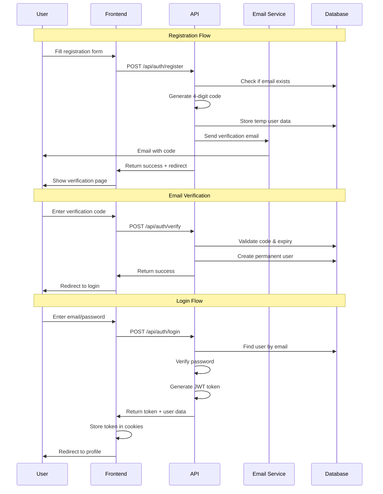

# Design Document - Email Authentication System

## Overview

Thiết kế hệ thống xác thực email hoàn chỉnh cho Fashion Store, bao gồm backend APIs, frontend components, database schema, và email service integration. Hệ thống sử dụng JWT cho session management và bcrypt cho mã hóa mật khẩu.

## Architecture

### High-Level Architecture

```
┌─────────────────┐    ┌─────────────────┐    ┌─────────────────┐
│   Frontend      │    │   Backend API   │    │   Email Service │
│   (Next.js)     │◄──►│   (Next.js API) │◄──►│   (Nodemailer)  │
└─────────────────┘    └─────────────────┘    └─────────────────┘
                                │
                                ▼
                       ┌─────────────────┐
                       │   Data Storage  │
                       │   (JSON/SQLite) │
                       └─────────────────┘
```

### Authentication Flow



## Components and Interfaces

### Frontend Components

#### 1. RegisterForm Component
```typescript
interface RegisterFormProps {
  onSuccess: (email: string) => void
  onError: (error: string) => void
}

interface RegisterFormData {
  firstName: string
  lastName: string
  email: string
  phone: string
  password: string
  confirmPassword: string
  agreeTerms: boolean
}
```

#### 2. EmailVerification Component
```typescript
interface EmailVerificationProps {
  email: string
  onSuccess: () => void
  onResend: () => void
}

interface VerificationState {
  code: string
  isLoading: boolean
  error: string | null
  timeLeft: number
  canResend: boolean
}
```

#### 3. LoginForm Component
```typescript
interface LoginFormProps {
  onSuccess: (user: User) => void
  onError: (error: string) => void
}

interface LoginFormData {
  email: string
  password: string
  rememberMe: boolean
}
```

### Backend API Endpoints

#### 1. Registration API
```typescript
// POST /api/auth/register
interface RegisterRequest {
  firstName: string
  lastName: string
  email: string
  phone: string
  password: string
}

interface RegisterResponse {
  success: boolean
  message: string
  data?: {
    email: string
    expiresAt: string
  }
}
```

#### 2. Email Verification API
```typescript
// POST /api/auth/verify
interface VerifyRequest {
  email: string
  code: string
}

interface VerifyResponse {
  success: boolean
  message: string
  data?: {
    userId: string
  }
}

// POST /api/auth/resend-code
interface ResendCodeRequest {
  email: string
}
```

#### 3. Login API
```typescript
// POST /api/auth/login
interface LoginRequest {
  email: string
  password: string
}

interface LoginResponse {
  success: boolean
  message: string
  data?: {
    user: User
    token: string
    expiresAt: string
  }
}
```

#### 4. Session Management
```typescript
// GET /api/auth/me
interface MeResponse {
  success: boolean
  data?: User
}

// POST /api/auth/logout
interface LogoutResponse {
  success: boolean
  message: string
}
```

## Data Models

### User Model
```typescript
interface User {
  id: string
  firstName: string
  lastName: string
  email: string
  phone: string
  passwordHash: string
  isVerified: boolean
  createdAt: string
  updatedAt: string
  lastLoginAt?: string
}
```

### Temporary User Model (for verification)
```typescript
interface TempUser {
  email: string
  firstName: string
  lastName: string
  phone: string
  passwordHash: string
  verificationCode: string
  expiresAt: string
  attempts: number
  createdAt: string
}
```

### Session Model
```typescript
interface Session {
  userId: string
  token: string
  expiresAt: string
  createdAt: string
  lastAccessAt: string
}
```

## Database Schema

### JSON File Structure
```json
{
  "users": [
    {
      "id": "uuid",
      "firstName": "string",
      "lastName": "string", 
      "email": "string",
      "phone": "string",
      "passwordHash": "string",
      "isVerified": true,
      "createdAt": "ISO string",
      "updatedAt": "ISO string",
      "lastLoginAt": "ISO string"
    }
  ],
  "tempUsers": [
    {
      "email": "string",
      "firstName": "string",
      "lastName": "string",
      "phone": "string", 
      "passwordHash": "string",
      "verificationCode": "string",
      "expiresAt": "ISO string",
      "attempts": 0,
      "createdAt": "ISO string"
    }
  ],
  "sessions": [
    {
      "userId": "string",
      "token": "string",
      "expiresAt": "ISO string",
      "createdAt": "ISO string",
      "lastAccessAt": "ISO string"
    }
  ]
}
```

## Email Service Integration

### Email Configuration
```typescript
interface EmailConfig {
  service: 'gmail' | 'smtp'
  host?: string
  port?: number
  secure?: boolean
  auth: {
    user: string
    pass: string
  }
}
```

### Email Templates
```typescript
interface VerificationEmailTemplate {
  subject: string
  html: string
  text: string
}

const verificationTemplate = {
  subject: 'Xác thực tài khoản Fashion Store',
  html: `
    <div style="font-family: Arial, sans-serif; max-width: 600px; margin: 0 auto;">
      <h2>Xác thực tài khoản của bạn</h2>
      <p>Mã xác thực của bạn là:</p>
      <div style="font-size: 24px; font-weight: bold; color: #667eea; text-align: center; padding: 20px; background: #f8f9fa; border-radius: 8px;">
        {{CODE}}
      </div>
      <p>Mã này sẽ hết hạn sau 10 phút.</p>
      <p>Nếu bạn không yêu cầu tạo tài khoản, vui lòng bỏ qua email này.</p>
    </div>
  `,
  text: 'Mã xác thực của bạn là: {{CODE}}. Mã này sẽ hết hạn sau 10 phút.'
}
```

## Security Implementation

### Password Hashing
```typescript
import bcrypt from 'bcryptjs'

const hashPassword = async (password: string): Promise<string> => {
  const saltRounds = 12
  return await bcrypt.hash(password, saltRounds)
}

const verifyPassword = async (password: string, hash: string): Promise<boolean> => {
  return await bcrypt.compare(password, hash)
}
```

### JWT Token Management
```typescript
import jwt from 'jsonwebtoken'

interface JWTPayload {
  userId: string
  email: string
  iat: number
  exp: number
}

const generateToken = (user: User): string => {
  return jwt.sign(
    { userId: user.id, email: user.email },
    process.env.JWT_SECRET!,
    { expiresIn: '7d' }
  )
}

const verifyToken = (token: string): JWTPayload | null => {
  try {
    return jwt.verify(token, process.env.JWT_SECRET!) as JWTPayload
  } catch {
    return null
  }
}
```

### Rate Limiting
```typescript
interface RateLimit {
  [key: string]: {
    attempts: number
    lastAttempt: number
    blockedUntil?: number
  }
}

const rateLimiter = {
  login: new Map<string, RateLimit>(),
  verification: new Map<string, RateLimit>()
}
```

## Error Handling

### Error Types
```typescript
enum AuthErrorType {
  VALIDATION_ERROR = 'VALIDATION_ERROR',
  USER_EXISTS = 'USER_EXISTS',
  USER_NOT_FOUND = 'USER_NOT_FOUND',
  INVALID_CREDENTIALS = 'INVALID_CREDENTIALS',
  INVALID_CODE = 'INVALID_CODE',
  CODE_EXPIRED = 'CODE_EXPIRED',
  TOO_MANY_ATTEMPTS = 'TOO_MANY_ATTEMPTS',
  EMAIL_SEND_FAILED = 'EMAIL_SEND_FAILED',
  TOKEN_INVALID = 'TOKEN_INVALID',
  TOKEN_EXPIRED = 'TOKEN_EXPIRED'
}

interface AuthError {
  type: AuthErrorType
  message: string
  field?: string
}
```

### Error Messages (Vietnamese)
```typescript
const errorMessages = {
  [AuthErrorType.VALIDATION_ERROR]: 'Thông tin không hợp lệ',
  [AuthErrorType.USER_EXISTS]: 'Email đã được sử dụng',
  [AuthErrorType.USER_NOT_FOUND]: 'Tài khoản không tồn tại',
  [AuthErrorType.INVALID_CREDENTIALS]: 'Email hoặc mật khẩu không đúng',
  [AuthErrorType.INVALID_CODE]: 'Mã xác thực không đúng',
  [AuthErrorType.CODE_EXPIRED]: 'Mã xác thực đã hết hạn',
  [AuthErrorType.TOO_MANY_ATTEMPTS]: 'Quá nhiều lần thử. Vui lòng thử lại sau',
  [AuthErrorType.EMAIL_SEND_FAILED]: 'Không thể gửi email. Vui lòng thử lại',
  [AuthErrorType.TOKEN_INVALID]: 'Phiên đăng nhập không hợp lệ',
  [AuthErrorType.TOKEN_EXPIRED]: 'Phiên đăng nhập đã hết hạn'
}
```

## Testing Strategy

### Unit Tests
- Password hashing/verification
- JWT token generation/validation
- Email template rendering
- Validation functions
- Rate limiting logic

### Integration Tests
- Registration flow end-to-end
- Email verification flow
- Login flow
- Session management
- Error handling scenarios

### API Tests
- All authentication endpoints
- Input validation
- Error responses
- Rate limiting
- Security headers

## Environment Variables

```env
# JWT Configuration
JWT_SECRET=your-super-secret-jwt-key
JWT_EXPIRES_IN=7d

# Email Configuration
EMAIL_SERVICE=gmail
EMAIL_HOST=smtp.gmail.com
EMAIL_PORT=587
EMAIL_USER=your-email@gmail.com
EMAIL_PASS=your-app-password

# Application
NEXT_PUBLIC_APP_URL=http://localhost:3001
NODE_ENV=development

# Database
DB_PATH=./data/auth.json
```

## Performance Considerations

### Caching Strategy
- Cache user sessions in memory
- Cache rate limiting data
- Implement cleanup for expired data

### Database Optimization
- Index on email field
- Regular cleanup of expired temp users
- Batch operations for bulk updates

### Email Service
- Queue email sending for better performance
- Retry mechanism for failed emails
- Template caching